# Class Diagram — Sistem Informasi Perpustakaan Saint Luke

Dokumen ini berisi **class diagram lengkap** sistem informasi perpustakaan sekolah *Saint Luke*
(Laravel + Filament). Diagram dimodelkan langsung dari kode (21 model Eloquent, migrasi basis data,
17 enumerasi, *trait*, relasi polimorfik, dan RBAC Spatie) dan menonjolkan pilar OOP: **pewarisan
(inheritance), kelas abstrak (abstract), polimorfisme (polymorphism), enkapsulasi (encapsulation),
antarmuka (interface), trait (mixin), serta kelas penghubung (association/junction class)** beserta
multiplisitas relasi **1:1, 1:N, dan N:M**.

Kelas dikelompokkan ke dalam tujuh **namespace** (kotak subsistem) agar layout rapi dan mudah dibaca:
**Abstraksi (OOP)**, **Anggota & Akses**, **Katalog**, **Peminjaman**, **Pengembalian & Denda**,
**Konten & Kunjungan**, serta **Enumerasi**.

---

## Diagram

```mermaid
classDiagram
    direction TB

    %% =====================================================================
    %% NAMESPACE: ABSTRAKSI (Inheritance, Abstract, Interface, Trait)
    %% =====================================================================
    namespace Abstraksi {
        class BaseModel {
            <<abstract>>
            #string table
            #array fillable
            #array casts
            #array hidden
            +save() bool
            +delete() bool
            +find(id) static$
            +query() Builder$
        }
        class Person {
            <<abstract>>
            +int id
            +string name
            +string username
            +string phone
            +string date_of_birth
            +string avatar
            +socialmedia() MorphMany
            +roles() BelongsToMany
            +hasRole(role) bool
        }
        class Socialable {
            <<interface>>
            +socialmedia() MorphMany
        }
        class FilamentUser {
            <<interface>>
            +canAccessPanel(panel) bool
        }
        class HasAvatar {
            <<interface>>
            +getFilamentAvatarUrl() string
        }
        class MustVerifyEmail {
            <<interface>>
            +hasVerifiedEmail() bool
        }
        class HasRoles {
            <<trait>>
            +assignRole(role) void
            +hasAnyRole(roles) bool
        }
        class SoftDeletes {
            <<trait>>
            #datetime deleted_at
            +trashed() bool
            +restore() void
        }
        class HandleReturnBook {
            <<trait>>
            #handleReturnBookCheck(record, oldCondition) void
        }
        class OptimizesImages {
            <<trait>>
            +optimizeImage(path, maxBytes) void
        }
    }

    %% =====================================================================
    %% NAMESPACE: ANGGOTA & AKSES
    %% =====================================================================
    namespace Anggota {
        class User {
            +string email
            -string password
            -string two_factor_secret
            +datetime email_verified_at
            +string address
            +UserType type
            +string type_other
            +bool is_approved
            +datetime approved_at
            +int approved_by
            +datetime member_card_issued_at
            +int member_card_issued_by
            +canAccessPanel(panel) bool
            +approve(approver) void
            +issueMemberCard(by) void
            +hasMemberCard() bool
            +getMemberNumberAttribute() string
            +findByMemberBarcode(value) User$
            +getFilamentAvatarUrl() string
            +loans() HasMany
            +loanDetails() HasManyThrough
            +books() HasMany
            +bookmarks() BelongsToMany
            +visits() HasMany
            +approver() BelongsTo
        }
        class Author {
            +UserGender gender
            +string nationality
            +string bio
            +datetime verified_at
            +books() BelongsToMany
            +socialmedia() MorphMany
        }
        class Role {
            +int id
            +string name
            +string guard_name
            +permissions() BelongsToMany
            +users() BelongsToMany
        }
        class Permission {
            +int id
            +string name
            +string guard_name
            +roles() BelongsToMany
        }
        class RouteAccess {
            +int id
            +string route_name
            #array role_ids
            #array permission_ids
            +getRoleNamesAttribute() string
            +getPermissionNamesAttribute() string
        }
    }

    %% =====================================================================
    %% NAMESPACE: KATALOG BUKU
    %% =====================================================================
    namespace Katalog {
        class Book {
            +int id
            +int publisher_id
            +int added_by
            +int language_id
            +string book_code
            +string title
            +string slug
            +int publication_year
            +string isbn
            +string synopsis
            +int number_of_pages
            +string location_book
            +BookStatus status
            +string cover
            +int price
            +PublishedBooks is_published
            +publisher() BelongsTo
            +language() BelongsTo
            +addedBy() BelongsTo
            +stock() HasOne
            +categories() BelongsToMany
            +authors() BelongsToMany
            +types() BelongsToMany
            +assets() BelongsToMany
            +bookmarks() BelongsToMany
            +loanDetails() HasMany
            +reviews() HasManyThrough
        }
        class Stock {
            +int id
            +int book_id
            +int total
            +int available
            +int loan
            +int lost
            +int damaged
            #booted() void$
            +book() BelongsTo
        }
        class Publisher {
            +int id
            +string name
            +string slug
            +string address
            +string email
            +string phone
            +string logo
            +bool is_active
            +books() HasMany
            +socialmedia() MorphMany
        }
        class Language {
            +int id
            +string code
            +string language
            +string photo
            +books() HasMany
        }
        class Category {
            +int id
            +string name
            +string slug
            +string icon
            +string photo
            +string description
            +bool is_active
            +books() BelongsToMany
            +informations() HasMany
            #booted() void$
        }
        class Type {
            +int id
            +string type
            +string icon
            +books() BelongsToMany
        }
        class Asset {
            +int id
            +string type
            +string utility_path
            +string pdf_path
            +ConvertStatusTypes status
            +books() BelongsToMany
        }
    }

    %% =====================================================================
    %% NAMESPACE: PEMINJAMAN
    %% =====================================================================
    namespace Peminjaman {
        class Loan {
            +int id
            +int user_id
            +string loan_code
            +LoanStatus status
            +user() BelongsTo
            +loanDetails() HasMany
            +books() BelongsToMany
            +returnBooks() HasManyThrough
            +recomputeStatus() LoanStatus
            +hasActiveLoan(userId, bookId) bool$
            +getActiveLoan(userId) Loan$
            +substractionStock(bookId) int$
            +checkStock(bookId) bool$
            +rollbacLoanStock(bookId) int$
        }
        class LoanDetail {
            <<association>>
            +int id
            +int loan_id
            +int book_id
            +date loan_date
            +date due_date
            +LoanBookStatus status
            +loan() BelongsTo
            +book() BelongsTo
            +returnBook() HasOne
            +review() HasOne
            +user() HasOneThrough
        }
    }

    %% =====================================================================
    %% NAMESPACE: PENGEMBALIAN & DENDA
    %% =====================================================================
    namespace Pengembalian {
        class ReturnBook {
            +int id
            +string return_book_code
            +int loan_user_id
            +date return_date
            +ReturnBookStatus status
            +loanDetail() BelongsTo
            +loan() HasOneThrough
            +book() HasOneThrough
            +fine() HasOne
            +returnBookCheck() HasOne
            +review() HasOne
            +getUserAttribute() User
        }
        class ReturnBookCheck {
            +int id
            +int return_book_id
            +BookCondition condition
            +string notes
            +returnBook() BelongsTo
            +addReturnStock(bookId) int$
            +addDamagedStock(bookId) int$
            +addLostStock(bookId) int$
        }
        class Fine {
            +int id
            +int return_book_id
            +string order_id
            +decimal late_fee
            +decimal other_fee
            +decimal total_fee
            +date fine_date
            +string payment_method
            +PaymentStatus payment_status
            +returnBook() BelongsTo
            +getUserAttribute() User
            +hasUnpaidFine(userId) bool$
        }
        class FineSettings {
            +int id
            +int late_fee_per_day
            +DiscountType damage_discount_type
            +int damage_fee_book
            +DiscountType lost_discount_type
            +int lost_fee_book
            +int loan_duration_days
            +checkSettings() FineSettings$
        }
        class ReviewBook {
            +int id
            +int loan_user_id
            +int return_book_id
            +decimal rating
            +string comment
            +loanDetail() BelongsTo
            +returnBook() BelongsTo
            +book() HasOneThrough
        }
    }

    %% =====================================================================
    %% NAMESPACE: KONTEN & KUNJUNGAN
    %% =====================================================================
    namespace Konten {
        class Announcement {
            +int id
            +Days days
            +string title
            +string description
            +string photo
            +string open_time
            +string close_time
            +bool is_active
        }
        class Information {
            +int id
            +string image
            +string name
            +string description
            +string slug
            +int category_id
            +category() BelongsTo
        }
        class SocialMedia {
            +int id
            +int socialable_id
            +string socialable_type
            +SocialMediaPlatform platform
            +string url
            +string label
            +string username
            +socialable() MorphTo
        }
        class Visit {
            +int id
            +int user_id
            +string name
            +string address
            +datetime visit_date
            +string type
            +string type_other
            +string needs
            +string note
            +user() BelongsTo
            +recordedToday(userId, name, ignoreId) bool$
            +getTypeLabelAttribute() string
        }
    }

    %% =====================================================================
    %% NAMESPACE: ENUMERASI (referensi tipe — tanpa garis agar rapi)
    %% =====================================================================
    namespace Enumerasi {
        class BookStatus {
            <<enumeration>>
            AVAILABLE
            UNAVAILABLE
            LOAN
            LOST
            DAMAGED
        }
        class PublishedBooks {
            <<enumeration>>
            PUBLISH
            UNPUBLISH
        }
        class LoanStatus {
            <<enumeration>>
            LOANED
            PARTIAL_RETURNED
            RETURNED
        }
        class LoanBookStatus {
            <<enumeration>>
            BORROWED
            RETURNED
        }
        class ReturnBookStatus {
            <<enumeration>>
            RETURNED
            CHECKED
            COST
        }
        class BookCondition {
            <<enumeration>>
            GOOD
            DAMAGED
            LOST
        }
        class PaymentStatus {
            <<enumeration>>
            PENDING
            SUCCESS
            FAILED
            ERROR
        }
        class DiscountType {
            <<enumeration>>
            PERCENTAGE
            FIXED
        }
        class UserType {
            <<enumeration>>
            TK
            SD
            SMP
            SMA
            SMK
            OTHER
        }
        class UserGender {
            <<enumeration>>
            MALE
            FEMALE
        }
        class ConvertStatusTypes {
            <<enumeration>>
            PROCESSING
            READY
            FAILED
        }
        class Days {
            <<enumeration>>
            MONDAY
            TUESDAY
            WEDNESDAY
            THURSDAY
            FRIDAY
            SATURDAY
            SUNDAY
        }
        class SocialMediaPlatform {
            <<enumeration>>
            INSTAGRAM
            FACEBOOK
            TWITTER
            TIKTOK
            WHATSAPP
            LINKEDIN
            GMAIL
        }
    }

    %% =====================================================================
    %% PEWARISAN (hanya hierarki konseptual — hub BaseModel tidak digambar)
    %% =====================================================================
    BaseModel <|-- Person
    Person <|-- User
    Person <|-- Author
    note for Person "Person = abstraksi User & Author. Seluruh entitas lain juga mewarisi BaseModel (Eloquent Model), tidak digambar agar rapi."

    %% =====================================================================
    %% REALISASI INTERFACE (realization)
    %% =====================================================================
    Socialable <|.. User
    Socialable <|.. Author
    Socialable <|.. Publisher
    FilamentUser <|.. User
    HasAvatar <|.. User
    MustVerifyEmail <|.. User

    %% =====================================================================
    %% PEMAKAIAN TRAIT (mixin) — 4 representatif
    %% =====================================================================
    Person ..> HasRoles : use
    Book ..> SoftDeletes : use
    Category ..> OptimizesImages : use
    ReturnBook ..> HandleReturnBook : use

    %% =====================================================================
    %% ASOSIASI / KOMPOSISI ANTAR-ENTITAS (multiplisitas)
    %% =====================================================================
    User "1" --> "0..*" Loan : memiliki
    User "1" --> "0..*" Visit : melakukan
    User "1" --> "0..*" Book : menambahkan
    User "0..*" -- "0..*" Book : bookmark
    User "1" --> "0..1" User : approved_by

    Loan "1" *-- "1..*" LoanDetail : terdiri atas
    Book "1" --> "0..*" LoanDetail : dipinjam

    LoanDetail "1" --> "0..1" ReturnBook : pengembalian
    LoanDetail "1" --> "0..1" ReviewBook : ulasan
    ReturnBook "1" *-- "1" ReturnBookCheck : pengecekan
    ReturnBook "1" --> "0..1" Fine : denda
    ReturnBook "1" --> "0..1" ReviewBook : ulasan
    Fine ..> FineSettings : tarif denda

    Book "1" --> "1" Stock : stok
    Book "0..*" --> "1" Publisher : penerbit
    Book "0..*" --> "1" Language : bahasa
    Book "0..*" -- "0..*" Author : author_of_books
    Book "0..*" -- "0..*" Category : book_of_categories
    Book "0..*" -- "0..*" Type : book_of_types
    Book "0..*" -- "0..*" Asset : book_of_assets

    Category "1" --> "0..*" Information : memuat

    %% =====================================================================
    %% POLIMORFIK & RBAC
    %% =====================================================================
    SocialMedia "0..*" --> "1" Socialable : socialable (morphTo)
    User "0..*" -- "0..*" Role : model_has_roles
    Author "0..*" -- "0..*" Role : model_has_roles
    Role "0..*" -- "0..*" Permission : role_has_permissions
    RouteAccess ..> Role : role_ids
    RouteAccess ..> Permission : permission_ids
```



> **Tips render.** Diagram ini ditujukan untuk **draw.io** (Mermaid 10.9.1): buka
> *Arrange ▸ Insert ▸ Mermaid*, tempel seluruh blok di atas, klik *Insert*. Tujuh kotak `namespace`
> akan tampil sebagai grup. Bila versi draw.io Anda lama dan menolak `namespace`, hapus saja baris
> `namespace ... {` beserta `}` penutupnya (kelas tetap muncul, hanya tanpa kotak). Untuk hasil ekspor
> gambar paling rapi (mis. ke laporan), render di **[mermaid.live](https://mermaid.live)** lalu
> tambahkan frontmatter berikut di baris paling atas — ELK merapikan rute garis otomatis (hanya jalan
> di mermaid.live, bukan di draw.io untuk class diagram):
>
> ```
> ---
> config:
>   layout: elk
> ---
> ```

---

## Legenda Notasi

### Stereotype kelas
| Notasi | Arti |
|---|---|
| `<<abstract>>` | Kelas abstrak — tidak diinstansiasi langsung, hanya diwarisi (`BaseModel`, `Person`) |
| `<<interface>>` | Antarmuka — kontrak method yang direalisasi kelas lain (`Socialable`, `FilamentUser`, …) |
| `<<trait>>` | Trait/mixin PHP — potongan perilaku yang dipakai-ulang banyak kelas |
| `<<enumeration>>` | Enumerasi — himpunan nilai konstan bertipe (status, jenis, dsb.) |
| `<<association>>` | Kelas penghubung (*association class*) pembawa atribut pada relasi N:M (`LoanDetail`) |

### Visibilitas (Enkapsulasi)
| Simbol | Arti | Contoh |
|---|---|---|
| `+` | public | `+title`, relasi & accessor |
| `-` | private | `-password`, `-two_factor_secret` (atribut `$hidden`) |
| `#` | protected | `#fillable`, `#casts`, `#deleted_at` (konfigurasi Eloquent) |
| `$` | static (di akhir method) | `findByMemberBarcode()$`, `hasActiveLoan()$` |

### Jenis relasi
| Garis | Jenis | Makna |
|---|---|---|
| `<\|--` | Generalization | Pewarisan (extends) |
| `<\|..` | Realization | Implementasi interface |
| `*--` | Composition | Bagian tak-terpisahkan dari pemilik (mis. `Loan` ⬦ `LoanDetail`) |
| `-->` | Association | Relasi terarah biasa (1:1 / 1:N) |
| `--` | Association | Relasi dua arah, dipakai untuk N:M |
| `..>` | Dependency | Ketergantungan/pemakaian (trait, perhitungan tarif, akses berbasis id) |
| `"1" "0..*" "1..*" "0..1"` | Multiplisitas | Kardinalitas pada tiap ujung relasi |

> **Catatan enum & pewarisan (agar diagram rapi):**
> Setiap **enumerasi** dirujuk sebagai **tipe atribut** (mis. `+BookStatus status` pada `Book`), jadi
> tidak digambar sebagai panah `..>` — daftar nilainya tersedia di kotak namespace **Enumerasi**.
> Begitu pula **pewarisan** hanya menggambar hierarki konseptual `BaseModel → Person → User/Author`;
> secara teknis seluruh entitas mewarisi `BaseModel` (Eloquent `Model`), tetapi garis ke-21 entitas
> tidak digambar agar tidak menumpuk.

---

## Tabel Relasi & Multiplisitas

| Kelas A | Kelas B | Jenis | Multiplisitas | Pivot / Foreign Key |
|---|---|---|---|---|
| BaseModel | Person | Generalization | — | (konseptual) extends Model |
| Person | User, Author | Generalization | — | extends |
| Person | HasRoles | Trait (use) | — | trait Spatie |
| User | Socialable, FilamentUser, HasAvatar, MustVerifyEmail | Realization | — | implements |
| User | Loan | Association | 1 → 0..* | `loans.user_id` |
| User | Visit | Association | 1 → 0..* | `visits.user_id` |
| User | Book | Association (added_by) | 1 → 0..* | `books.added_by` |
| User | Book | **N:M** (bookmark) | 0..* — 0..* | `bookmarks` |
| User | User | Self-association | 1 → 0..1 | `users.approved_by` |
| Loan | LoanDetail | **Composition** | 1 ◆— 1..* | `loan_details.loan_id` |
| Book | LoanDetail | Association | 1 → 0..* | `loan_details.book_id` |
| LoanDetail | ReturnBook | Association | 1 → 0..1 | `return_books.loan_user_id` |
| LoanDetail | ReviewBook | Association | 1 → 0..1 | `review_books.loan_user_id` |
| ReturnBook | ReturnBookCheck | **Composition** | 1 ◆— 1 | `return_book_checks.return_book_id` |
| ReturnBook | Fine | Association | 1 → 0..1 | `fines.return_book_id` |
| ReturnBook | ReviewBook | Association | 1 → 0..1 | `review_books.return_book_id` |
| Book | Stock | Association | **1 → 1** | `stocks.book_id` |
| Book | Publisher | Association | 0..* → 1 | `books.publisher_id` |
| Book | Language | Association | 0..* → 1 | `books.language_id` |
| Book | Author | **N:M** | 0..* — 0..* | `author_of_books` |
| Book | Category | **N:M** | 0..* — 0..* | `book_of_categories` |
| Book | Type | **N:M** | 0..* — 0..* | `book_of_types` |
| Book | Asset | **N:M** | 0..* — 0..* | `book_of_assets` |
| Category | Information | Association | 1 → 0..* | `informations.category_id` |
| Fine | FineSettings | Dependency | menghitung | (tanpa FK) |
| SocialMedia | User / Publisher / Author | **Polimorfik** | 0..* → 1 | `socialable_id` + `socialable_type` |
| User / Author | Role | **N:M** | 0..* — 0..* | `model_has_roles` |
| Role | Permission | **N:M** | 0..* — 0..* | `role_has_permissions` |
| RouteAccess | Role / Permission | Dependency | by JSON id | `role_ids`, `permission_ids` |

---

## Penonjolan Pilar OOP

- **Inheritance & Abstract** — `BaseModel` (abstrak) menjadi induk; `Person` (abstrak) menyatukan
  atribut & perilaku bersama `User` dan `Author`. Demi kerapian, hanya hierarki `BaseModel → Person →
  User/Author` yang digambar (lihat catatan).
- **Polymorphism** —
  - *Polimorfisme relasi:* `SocialMedia.socialable()` (`morphTo`) menunjuk ke `User`, `Publisher`,
    atau `Author` melalui pasangan `socialable_id` + `socialable_type`.
  - *Polimorfisme runtime (overriding):* method seperti `casts()`, serta `label()`, `color()`,
    `icon()` pada setiap enum, di-*override* sesuai konteks tiap kelas/case.
- **Encapsulation** — data sensitif (`password`, `two_factor_secret`) bervisibilitas `-` (private,
  daftar `$hidden`); konfigurasi internal (`$fillable`, `$casts`) bervisibilitas `#` (protected);
  akses ke data domain melalui *accessor* publik (mis. `getMemberNumberAttribute`,
  `getUserAttribute`).
- **Interface** — `User` merealisasi `FilamentUser`, `HasAvatar`, `MustVerifyEmail`; `User`,
  `Publisher`, `Author` merealisasi `Socialable`.
- **Trait (mixin)** — `HasRoles`, `SoftDeletes`, `OptimizesImages`, `HandleReturnBook` dipakai-ulang
  lintas kelas tanpa pewarisan tunggal (di diagram ditandai panah `..> use` representatif;
  `SoftDeletes` juga dipakai `User`, `Publisher`, `Announcement`).
- **Kelas penghubung (junction/association class)** — `LoanDetail` adalah *association class*
  pembawa atribut (`loan_date`, `due_date`, `status`) yang menghubungkan `Loan`↔`Book`; tabel pivot
  murni (`author_of_books`, `book_of_categories`, `book_of_types`, `book_of_assets`, `bookmarks`,
  `model_has_roles`, `role_has_permissions`) menyatakan relasi **N:M**.

---

## Alur Bisnis Ringkas (konteks relasi)

1. **Registrasi & Anggota** — `User` mendaftar, disetujui admin (`approve()`), lalu diterbitkan
   kartu anggota (`issueMemberCard()`, barcode/QR = `username`). Hak akses diatur lewat `Role`,
   `Permission`, dan `RouteAccess`.
2. **Katalog** — `Book` dirangkai dari `Publisher`, `Language`, banyak `Author`/`Category`/`Type`/
   `Asset`, dengan `Stock` (1:1) yang divalidasi (`available + loan + lost + damaged = total`).
3. **Peminjaman** — `Loan` dibuat untuk seorang `User`; tiap buku menjadi satu `LoanDetail`
   (`due_date` dari `FineSettings.loan_duration_days`); stok dikurangi (`substractionStock()`).
4. **Pengembalian** — `ReturnBook` mengacu ke `LoanDetail`; `ReturnBookCheck` mencatat kondisi
   (`GOOD`/`DAMAGED`/`LOST`) dan memperbarui stok; `Loan.recomputeStatus()` menghitung ulang status.
5. **Denda & Ulasan** — bila terlambat/rusak/hilang, `Fine` dibuat otomatis (telat + biaya
   kerusakan/kehilangan berdasarkan `FineSettings` & `DiscountType`); `User` dapat memberi
   `ReviewBook` (rating + komentar) atas buku yang telah dikembalikan.

> **Catatan akademik.** `BaseModel` dan `Person` adalah abstraksi pemodelan untuk menonjolkan
> pewarisan & enkapsulasi. Pada kode nyata, peran `BaseModel` diisi `Illuminate\Database\Eloquent\Model`,
> sementara `User extends Authenticatable` dan `Author extends Model` — keduanya berbagi struktur
> (`name`, `username`, `phone`, `avatar`), trait `HasRoles`, dan relasi `socialmedia()` yang
> diabstraksikan menjadi `Person`.
